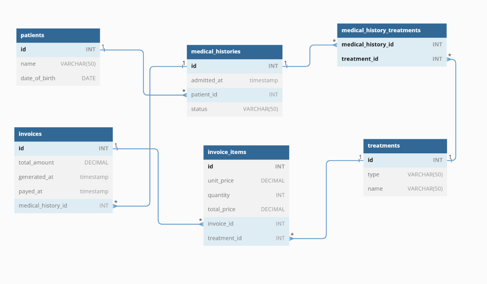

<div align="center">
    
  <br/>
  <h3><b>Paws and Claws Clinic</b></h3>

</div>
<!-- TABLE OF CONTENTS -->

# 📗 Table of Contents

- [📗 Table of Contents](#-table-of-contents)
- [📖 Paws and Claws Clinic ](#-paws-and-claws-clinic-)
  - [🛠 Built With ](#-built-with-)
    - [Tech Stack ](#tech-stack-)
    - [Key Features ](#key-features-)
  - [💻 Getting Started ](#-getting-started-)
    - [Prerequisites](#prerequisites)
    - [Setup](#setup)
    - [Install](#install)
    - [Usage](#usage)
    - [Run tests](#run-tests)
  - [👥 Authors ](#-authors-)
  - [🔭 Future Features ](#-future-features-)
  - [🤝 Contributing ](#-contributing-)
  - [⭐️ Show your support ](#️-show-your-support-)
  - [🙏 Acknowledgments ](#-acknowledgments-)
  - [❓ FAQ ](#-faq-)
  - [📝 License ](#-license-)

<!-- PROJECT DESCRIPTION -->

# 📖 Paws and Claws Clinic <a name="about-project"></a>

**The Paws and Claws Vet Clinic Database** is a PostgreSQL system designed for managing essential information about pet patients in a veterinary clinic. The database stores and organizes data such as pet names, birth dates, weight, neutering status, and escape attempts, providing the clinic staff with a convenient way to track and access this crucial information. It also offers querying capabilities, which help in analysis, reporting, and decision-making, as a result enhancing the efficiency of the clinic's operations and the quality of care provided to the pets.

## 🛠 Built With <a name="built-with"></a>

### Tech Stack <a name="tech-stack"></a>

<details>
<summary>Database</summary>
  <ul>
    <li><a href="https://www.postgresql.org/">PostgreSQL</a></li>
  </ul>
</details>
<details>
<summary>Query Language</summary>
  <ul>
    <li><a href="https://www.w3schools.com/sql/">SQL</a></li>
  </ul>
</details>

<!-- Features -->

### Key Features <a name="key-features"></a>


- **Robust Data Management**: The database offers a systematic way to manage information about the clinic's animal patients, making data retrieval and tracking more efficient.
- **Comprehensive Querying Capabilities**: SQL is used to interact with the database, providing powerful querying options for extracting and manipulating data according to various needs.
- **Scalability**: PostgreSQL, as an open-source relational database, offers high scalability, making the database capable of handling an increasing amount of data as the clinic grows.
- **Data Integrity**: PostgreSQL provides strong data consistency and supports ACID (Atomicity, Consistency, Isolation, Durability) properties, ensuring the reliability and integrity of data.
- **Flexibility**: The database schema can be easily adjusted to accommodate changing requirements, demonstrating the system's adaptability.

<p align="right">(<a href="#readme-top">back to top</a>)</p>

<!-- GETTING STARTED -->

## 💻 Getting Started <a name="getting-started"></a>

To get a local copy up and running, follow these steps.

### Prerequisites

In order to run this project you need:

- PostgreSQL installed on your machine. You can download it from the [official website](https://www.postgresql.org/download/).


### Setup

Clone this repository to your desired folder:

```sh
  cd your-folder
  git clone https://github.com/Alejandroq12/vet-clinic.git
```

### Install

Navigate into your project directory and set up your database:

```sh
  cd your-project
  psql -U postgres -f schema.sql
```

### Usage

To interact with the database, open PostgreSQL and connect to the database:

Connect to database
```sh
  psql -U postgres -d vet_clinic
```

### Run tests

To run tests, run the following command (functionality will be added in the future):

```sh
  // command to run tests will be available in the future.
```

<p align="right">(<a href="#readme-top">back to top</a>)</p>

<!-- AUTHORS -->

## 👥 Authors <a name="authors"></a>

👤 **Julio Quezada**

- GitHub: [Alejandroq12](https://github.com/Alejandroq12)
- Twitter: [@JulioAle54](https://twitter.com/JulioAle54)
- LinkedIn: [Julio Quezada](https://www.linkedin.com/in/quezadajulio/)

<p align="right">(<a href="#readme-top">back to top</a>)</p>

<!-- FUTURE FEATURES -->

## 🔭 Future Features <a name="future-features"></a>

- [x] Project 1: create animals table.
- [] Project 2: query and update animals table.
- [] Project 3: query multiple tables.
- [] Project 4: add "join table" for visits.
- [] Project 5: database performance audit.
- [] Exercise: add database schema diagram.

<p align="right">(<a href="#readme-top">back to top</a>)</p>

<!-- CONTRIBUTING -->

## 🤝 Contributing <a name="contributing"></a>

Contributions, issues, and feature requests are welcome!

Feel free to check the [issues page](../../issues/).

<p align="right">(<a href="#readme-top">back to top</a>)</p>

<!-- SUPPORT -->

## ⭐️ Show your support <a name="support"></a>

If you like this project please give a star.
Thanks in advance.

<p align="right">(<a href="#readme-top">back to top</a>)</p>

<!-- ACKNOWLEDGEMENTS -->

## 🙏 Acknowledgments <a name="acknowledgements"></a>

I would like to thank all of my colleagues who inspire to do my best everyday.

<p align="right">(<a href="#readme-top">back to top</a>)</p>

<!-- FAQ (optional) -->

## ❓ FAQ <a name="faq"></a>

- **Did you create this project from scratch?**

  - Yes, and for that reason I learned a lot.


<p align="right">(<a href="#readme-top">back to top</a>)</p>

<!-- LICENSE -->

## 📝 License <a name="license"></a>

This project is [MIT](./LICENSE) licensed.

<p align="right">(<a href="#readme-top">back to top</a>)</p>
